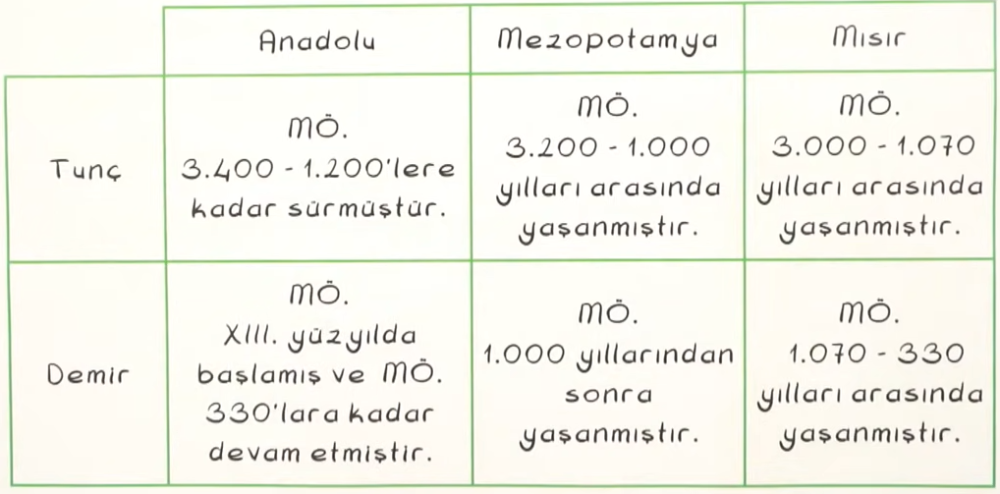
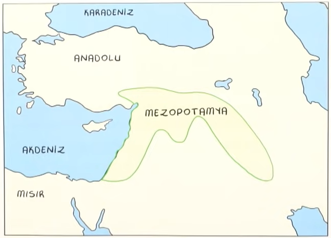

# İnsanlığın İlk İzleri

Yazı öncesi dönemin aydınlatılabilmesinde en önemli unsur <b>arkeolojik</b> araştırmalardır.

2.5 milyon yıl önce dünyanın buzlarla kaplı olması nedeniyle yerleşmeler görülmez.
12 bin yıl önce Anadolu'nun güneydoğusunda ve Mezopotamya'da yerleşimler ortaya çıkmıştır.

Bereketli <b>Hilal</b> olarak da adlandırılan bu coğrafyada iklim giderek insan yaşamına uygun hâle gelmiş ve bu bölgede nüfus artmaya başlamıştır.

### Yazı öncesi dönemin aydınlatılmasında;

- Mağralar
- Kerpiçten ilkel evler
- Taş aletler
- Kemik süslemeleri
- Pişmiş kil aletler

<i>o döneme ayna tutar.</i>

### Yazı öncesinde insanlar;

- Mağara ve kaya sığınaklarında yaşamış,
- avcılık ve toplayıcılık yapmış,
- çeşitli yabani meyveler ve bitkiler tüketmiş,
- iklimin ılımanlaşmasıyla tarımsal faaliyetler başlamış,
- tarıma geçişle beraber hayvanları evcilleştirmiştir.
&nbsp;
## İlk İnsanların Hayat Tarzı ve Geçim Kaynakları

- İlk insanlar avcılık ve toplayıcılık yapıyorlardı.
- Besin bulabilmek için göçebe bir hayat sürüyorlardı.
- Tarımla birlikte yerleşik hayata geçildi.
- Yerleşik yaşam ilk köy yerleşmelerini ve kabileleri ortaya çıkardı.
- Sonra kabileler büyüdü büyüdü devlet oldu.
&nbsp;
## Yerleşik İnsan ve Medeniyet

### Anadolu'daki İlk Yerleşim Merkezleri

* * *

#### Çayönü

Türkiye'de ve Güneydoğu Avrupa'da Yeni Taş Çağı'nda kurulan ilk <b>köy</b> yerleşim yeridir.

* * *

#### Çatalköyük

İnsanlık tarihinin ilk <b>kent</b> yerleşmesi olarak kabul edilmektedir. UNESCO listesindedir.

* * *

#### Göbeklitepe

Günümüze kadar keşfedilen en erken tarihli <b>tapınak</b> mimari yerleşim merkezidir. UNESCO listesindedir.
&nbsp;

## Sözlü Kültür

Yazının olmadığı toplumlarda kayıtlara geçmemiş ve konuşma dili yoluyla kuşaktan kuşağa aktarılan kültürdür.

### Sözlü Kültür Ürünleri

- Efsaneler
- Mitler
- Destanlar
- Maniler
- Türküler
- Fıkralar
- Bilmeceler

## Tarih Öncesi Dönemlendirme

- Tarih öncesi çağlar sınıflandırılırken insanların kullanmış olduğu araçlar ve madenler esas alınmıştır.
- Zamanla bu dönemlendirmeye, yerleşme, üretim biçimi, yaşam koşullarını belirleyen diğer etkenler gibi faktörler de eklenmiştir.

### Taş Çağı

- Eski Taş
- Orta Taş
- Yeni Taş
&nbsp;

### Maden Çağı

- Bakır
- Tunç
- Demir
&nbsp;

### Üç Çağ Sistemi

- C.J. Thomsen tarafından 1836'da kurulmuştur.
- J. Lobbock 1865 yılında ayrıntılı bir şekilde yeniden ele almıştır.
&nbsp;

Tarih öncesi devirler her bölgede aynı anda yaşanmamıştır.
&nbsp;

 

<i>Son<i>
